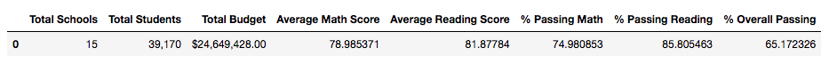
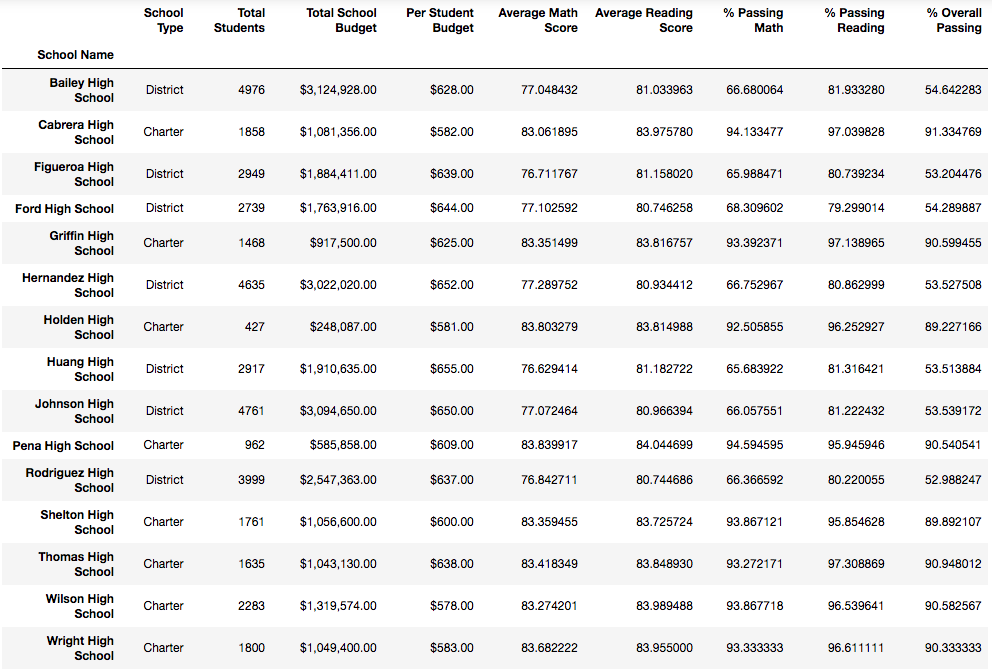
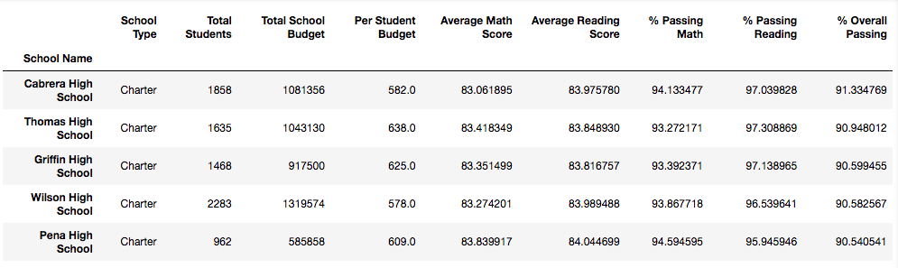
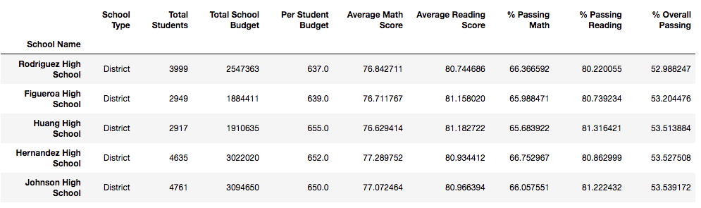
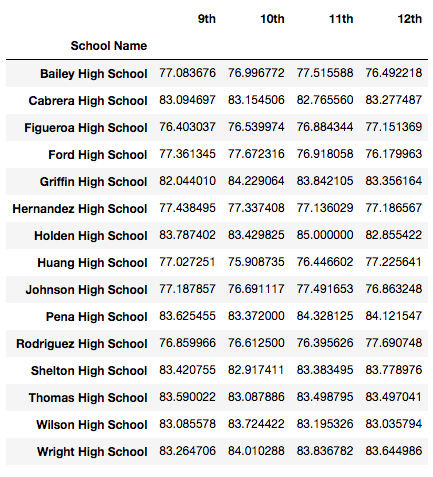
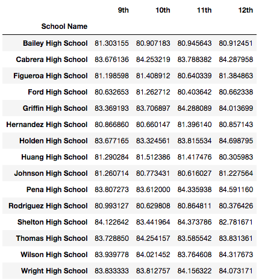
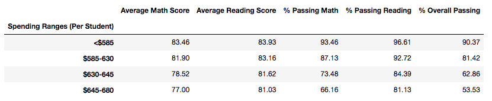
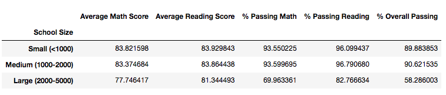
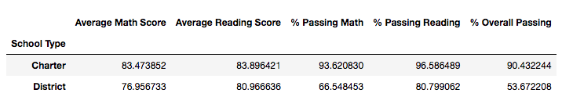

 # 
 <ins>Pandas Challenge</ins>

## PyCitySchool

As the new *Chief Data Scientist* for my city's school district, I have been requested to help the school board and mayor make strategic decisions regarding future school budgets and priorities. 

Two csv files were given, from which I created scripts to analyse the following data. 
The raw data given are every student's math and reading scores, as well as various information on the schools they attend. The final report will include each of the following:

* District Summary
* School Summary
* Highest-Performing Schools (by % Overall Passing)
* Lowest-Performing Schools (by % Overall Passing)
* Maths scores by Grade 
* Reading scores by Grade
* Scores by School Spending
* Scores by School Size
* Scores by School Type
* Analysis

----

### <ins>District Summary</ins>

I was asked to create a high-level snapshot of the district's key metrics in a DataFrame, which included the following:

* Total schools

* Total students

* Total budget

* Average math score

* Average reading score

* % passing math (the percentage of students who passed math)

* % passing reading (the percentage of students who passed reading)

* % overall passing (the percentage of students who passed math AND reading)

---

  ### <ins>School Summary</ins>
I also created a DataFrame that summarises key metrics about each school, including the following:

* School name

* School type

* Total students

* Total school budget

* Per student budget

* Average math score

* Average reading score

* % passing math (the percentage of students who passed math)

* % passing reading (the percentage of students who passed reading)

* % overall passing (the percentage of students who passed math AND reading)

**School Summary Data File** >> [Click here](Output/school_summary_convert.csv)

---

### <ins>Highest-Performing Schools (by % Overall Passing)</ins>
Here I created a DataFrame that highlights the top-5 performing schools based on % Overall Passing. This DataFrame included the following metrics:

* School name

* School type

* Total students

* Total school budget

* Per student budget

* Average math score

* Average reading score

* % passing math (the percentage of students who passed math)

* % passing reading (the percentage of students who passed reading)

* % overall passing (the percentage of students who passed math AND reading)

**Highest-Performing Schools Data File** >> [Click here](Output/top_five_performing_schools.csv)

---

### <ins>Lowest-Performing Schools (by % Overall Passing)</ins>
This DataFrame highlights the bottom-5 performing schools based on % Overall Passing. It includes the following metrics:

* School name

* School type

* Total students

* Total school budget

* Per student budget

* Average math score

* Average reading score

* % passing math (the percentage of students who passed math)

* % passing reading (the percentage of students who passed reading)

* % overall passing (the percentage of students who passed math AND reading)

**Lowest-Performing Schools Data File** >> [Click here](Output/bottom_five_performing_schools.csv)

---

### <ins>Math Scores by Grade</ins>
Here I created a DataFrame that lists the average math score for students of each grade level (9th, 10th, 11th, 12th) at each school.

**Math Scores by Grade Data File** >> [Click here](Output/maths_score_grade.csv)

---

### <ins>Reading Scores by Grade</ins>
Here I created a DataFrame that lists the average reading score for students of each grade level (9th, 10th, 11th, 12th) at each school.

**Reading Scores by Grade Data File** >> [Click here](Output/reading_score_by_grade.csv)

---

### <ins>Scores by School Spending</ins>

Here you can see a table I created that breaks down school performance based on average spending ranges (per student). I used my own judgment to create four bins with reasonable cutoff values to group school spending. The DataFrame includes the following metrics:

* Average math score

* Average reading score

* % passing math (the percentage of students who passed math)

* % passing reading (the percentage of students who passed reading)

* % overall passing (the percentage of students who passed math AND reading)

**Scores by School Spending Data File** >> [Click here](Output/scores_by_school_spending.csv)

---

### <ins>Scores by School Size</ins>
Here I created a table that breaks down school performance based on school size (small, medium, or large).

**Scores by School Size Data File** >> [Click here](Output/scores_by_school_size.csv)

---

### <ins>Scores by School Type</ins>
In section, I created a table that breaks down school performance based on school type (district or charter).

---

### <ins>Analysis</ins>

1) Looking at the school performances based on average Spending Ranges, we can see that children who fell in the less than $585 spending range, scored higher results in comparision to those children who had a budget in the range of $645 - 680.

2) Schools with less than 1000 students performed better in their Maths and Reading, compared to school that had more than 2000 students. The performance of Schools that had less than 2000 students, were very close in figures to schools with less than 1000 students.

3) Children who attended Charter schools, performed really well in their maths and reading, compared to children who attened District schools. The difference between the two overall passing percentage is extremely apart, where Charter school has an overall pass percentage of 90.43% and District with an overall pass percentage 53.67%.

4) Although more children in schools would mean having a higher budget, having less children in a school or smaller teaching groups would mean that children would be given quality teaching as the teacher could provide more 1:1 support, resulting to higher scores in maths and reading.

